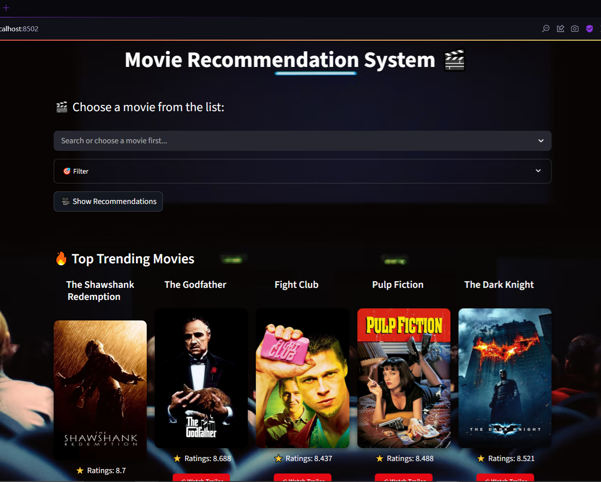

# 🎬 Movie Recommendation System

[](https://streamlit.io/)
[](https://www.themoviedb.org/)

A sleek and interactive web application that recommends movies based on your selection, filters by genre, and displays top trending films. Powered by content-based recommendation using **TF-IDF** and **Cosine Similarity**, enriched with **TMDb API** for dynamic posters, ratings, and trailers.



## 🚀 Features

- 🔍 **Searchable Movie List** with smart placeholder
- � **Genre Filter** to narrow recommendations
- 🤖 **Content-Based Recommendations** using similarity scores
- 🔥 **Top Trending Section** with weighted rating
- 🎞️ **YouTube Trailers** integration
- 🎨 **Modern UI** with background image & dark/light mode
- 📱 **Responsive Design** works on all devices

## 🛠 Tech Stack

| Category | Technologies |
|----------|--------------|
| **Backend** | Python 3, Streamlit |
| **Data Processing** | Pandas, Scikit-learn |
| **APIs** | TMDb API, YouTube API |
| **ML Techniques** | TF-IDF Vectorization, Cosine Similarity |
| **Environment** | dotenv, pickle |

## 🧠 How It Works

1. **Data Processing**: Movie metadata is transformed using TF-IDF vectorization
2. **Similarity Modeling**: Cosine similarity calculates movie relationships
3. **User Selection**: When a movie is selected:
   - System identifies top 5 similar titles
   - Fetches live data from TMDb API
4. **Trending Calculation**: Uses IMDB weighted rating formula:(v/(v+m) * R) + (m/(m+v) * C)
5. **UI Rendering**: Streamlit dynamically updates the interface

## ⚙️ Setup Instructions

### Prerequisites
- Python 3.8+
- TMDb API key ([Get it here](https://www.themoviedb.org/documentation/api))

### Installation
```bash
# Clone repository
git clone https://github.com/your-username/movie-recommendation-app.git
cd movie-recommendation-app

# Create virtual environment
python -m venv venv
source venv/bin/activate  # Linux/Mac
.\venv\Scripts\activate  # Windows

# Install dependencies
pip install -r requirements.txt
```

### Configuration
1. Create `.env` file in project root:
```env
TMDB_API_KEY=your_api_key_here
```

### Run Application
```bash
streamlit run app.py
```

## 📂 Project Structure
```
movie-recommendation-app/
├── movies rcommendation system.ipynb # main project
├── app.py # Main application logic
├── movies.pkl # Movie dataset
├── similarity.pkl # Precomputed similarity matrix
├── requirements.txt # Python dependencies
├── .env # API keys (gitignored)
├── .gitignore # Ignore environment files
└── README.md # Project documentation
```

## 📌 Notes
- First run may take longer due to API data fetching
- `.env` is included in `.gitignore` by default
- Precomputed pickle files optimize performance

